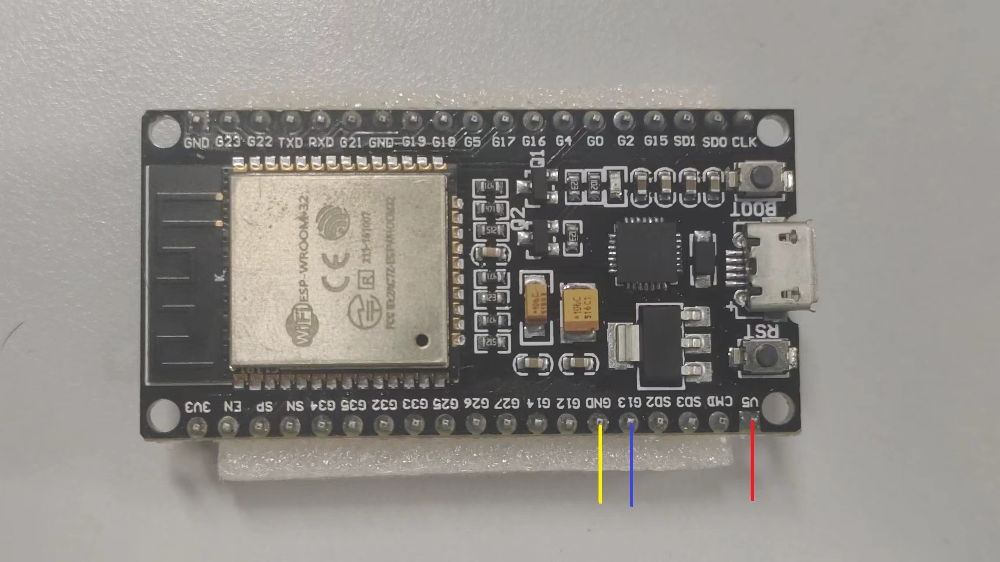
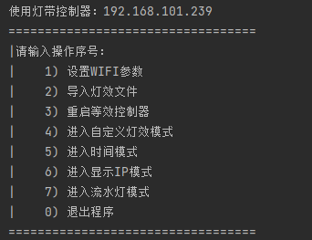

# 使用说明

## 接线

红线为+5V，黄线为GND，蓝线为WS2812控制线，接单片机的G13引脚。在开发板上的接线如图：

## 使用

### 首次使用
首次启动时控制器会创建一个名为RBGLIGHT-XXXXX的wifi热点，密码为12345678。
使用电脑连接该热点，并运行controller/main.py，软件会自动在局域网内搜索控制器，搜索完成后如下图所示：

输入1进入WIFI设置模式，在其中输入WIFI SSID与密码，之后输入3重启控制器。
控制器重启后会自动连接到设置的WIFI上，将电脑也连入同一网段，重启controller/main.py即可进行后续操作。

### 内置灯效

运行controller/main.py启动控制软件，输入4-7可在内置的4种灯效中切换。内置灯效介绍如下：

#### 时间模式

运行控制软件后输入5进入时间模式。灯带上共有60个灯珠对应指针时钟的60个刻度，红色为时针、蓝色为分针、绿色为秒针。
连入可以连接到互联网的WIFI后会自动进行时间同步，如果不能上网暂时也没办法调整时间。

#### 显示IP模式

运行控制软件后输入6进入显示IP模式。此时灯带上会以二进制的方式显示出当前开发板的IP地址。
红黄蓝三种颜色为IP地址本身，橙色为点。

#### 流水灯模式

运行控制软件后输入7进入流水灯模式。就是个流水灯。

#### 自定义灯效模式

运行控制软件后输入4进入自定义灯效模式。详见下一章。

### 自定义灯效

自定义灯效为JSON文件，其中包含四个字段

+ total_frames：总帧数，最大支持240帧。
+ ms_per_frame：每帧之间的间隔时间，单位为毫秒。
+ name：灯效名称。
+ frames：为total_frames*60的二维数组，frame\[i\]\[j\]表示第i帧第j个灯珠的RBG颜色，值为(r<<16)+(b<<8)+g。

灯效文件应与main.py放在同一目录下，命名为effect_xxxx.json。可通过运行控制软件输入2将灯效文件加载至控制器。
由于ESP32内部存储空间的限制，灯效文件暂时不能永久保存，断电后需要重新下载灯效文件。

生成灯效文件的代码可以参考effect_generator.py
